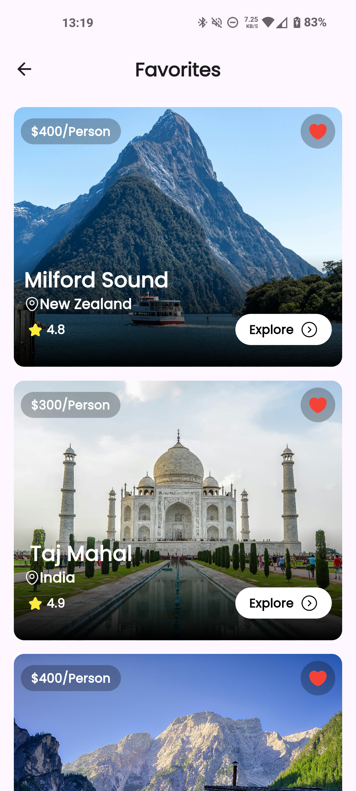

# Travel App UI

  A travel app ui completly made with Flutter and Dart

# Tools used: 
  - **Provider - State Management**
  - **GetX - Routing/Navigation and Animation**
  - **Lottie - Animations**

# Output

    
    
    
    
    
    
    
    

